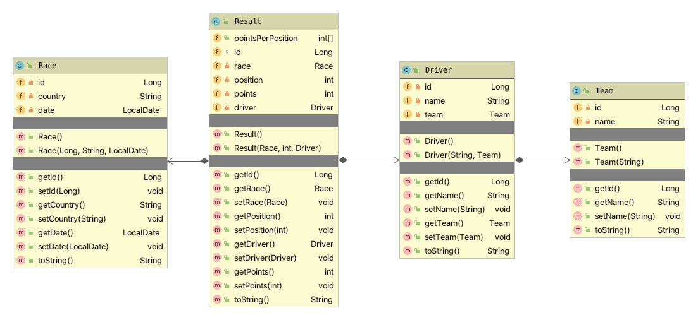

# Formula 1

:Author:    Thomas Stütz
:Email:     <t.stuetz@htl-leonding.ac.at>
:Date:      2019-11-02
:Revision:  1.0

Version: {revision}

++++
<link rel="stylesheet"  href="http://cdnjs.cloudflare.com/ajax/libs/font-awesome/4.7.0/css/font-awesome.min.css">
++++

:icons: font

## Kurzbeschreibung

Die Daten der Formel-1-Weltmeisterschaft 2018 liegen wie folgt vor:

----
- races.csv // <1>
- teams.csv  // <1>
- results // <2>
----

<1> `races.csv` und `teams.csv` sind Dateien, die bereits im resources-Ordner im Projekt enthalten sind.
<2> Die Daten von `result` sind von einem REST-Endpoint abzurufen

IMPORTANT: Die Id's in der Datenbank-Tabelle F1_RACE werden nicht von der Datenbank generiert, sondern werden als Parameter mitgegeben.

Ihre Applikation soll diese Daten einlesen und Objekte der entsprechenden Klassen erzeugen. Mit deren Hilfe sollen anschließend folgende Auswertungen möglich sein:

- Gesamtpunkte eines Fahrers
- Fahrerweltmeister
- Konstrukteursweltmeister (=Teamweltmeister)
- Siegers eines bestimmten Rennens
- Liste der Rennen, die ein Fahrer / Team gewonnen hat

## Aufgabenstellung

### Aufgabe 1: Import CSV

Als erste Aufgabe sollen die CSV-Dateien races.csv und teams.csv eingelesen werden.
Hierfür sind bereits folgende Klassen implementiert:

.Klassendiagramm

Die Annotationen zum Speichern in der Datenbank sind noch hinzuzufügen.

IMPORTANT: Die Datei `teams.csv` wird auf zwei Klassen `Driver` und `Team` aufgeteilt.

.Entity-Relationship-Diagram (ERD)

#### Ergebnis

.Tabelleninhalt F1_TEAM

.Tabelleninhalt F1_DRIVER

.Tabelleninhalt F1_RACE

### Aufgabe 2: Import REST

Als zweite Aufgabe sollen die Ergebnisse (Result) von einem gegebenen REST-Endpoint eingelesen werden.
Implementieren Sie hierfür die Klasse `ResultRestClient`:

#### Link der Resource

http://vm90.htl-leonding.ac.at/results

#### Errechnen der Punkte

In der Tabelle sollen für jede Position die Anzahl der Punkte ermittel werden.
Diese werden bei einem Formel-1-Rennen folgendermaßen vergeben:

1. Platz = 25 Punkte
2. Platz = 18 Punkte
3. Platz = 15 Punkte
4. Platz = 12 Punkte
5. Platz = 10 Punkte
6. Platz = 8 Punkte
7. Platz = 6 Punkte
8. Platz = 4 Punkte
9. Platz = 2 Punkte
10. Platz = 1 Punkt

#### Ermitteln der Id des Fahrers

Für jeden Driver wird nach Namen in der Driver-Tabelle gesucht und zum Anlegen der Result-Objekte verwendet

#### Daten des Endpoints (teilweise)

#### Ergebnis

.Tabelleninhalt (teilweise) F1_RESULT

Die Tabelle F1_RESULT enthält 420 Zeilen.

### Aufgabe 3: Gesamtpunkte eines Fahrers

Als dritte Aufgabe sollen die Ergebnisse (Result) von einem gegebenen REST-Endpoint eingelesen werden.
Implementieren Sie hierfür folgende Klasse mit der Methode `getPointsSumOfDriver(...)`:

#### Request (Beispiel)

----
GET http://localhost:8080/formula1/api/results?name=Lewis+Hamilton
----

#### Ergebnis

#### Kontrolle der Punkte

https://www.motorsport-total.com/formel-1/ergebnisse/wm-stand/2018/fahrerwertung

### Aufgabe 4: : Siegers eines bestimmten Rennens

#### Request (Beispiel)

----
GET http://localhost:8080/formula1/api/results/winner/Spain
----

### Aufgabe 5: Liste der Rennen, die ein Team gewonnen hat

#### Request (Beispiel)

----
GET http://localhost:8080/formula1/api/results/raceswon?team=Ferrari
----

### Aufgabe 6 (für Spezialisten): Liste aller Fahrer mit ihren Punkten

TIP: Verwenden Sie als Rückgabetyp bei mehreren Rückgabespalten der Query ein `List<Object[]>`

#### Request (Beispiel)

----
GET http://localhost:8080/formula1/api/results/all
----

IMPORTANT: Die Requests finden Sie in der Datei `/http-request/results.http`

